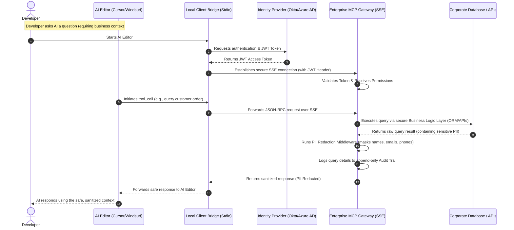

# Enterprise Secure MCP Bridge — Blueprint & Boilerplate
> Secure data sharing and PII redaction wrapper for Enterprise AI Assistants (Cursor, Windsurf, Claude Desktop, Feishu/Lark AI)

This repository provides the system architecture, code blueprints, and deployment guidelines for **Enterprise Secure MCP Bridge**. This solution solves the security bottleneck of source code leaks and personally identifiable information (PII) exposure when B2B/SME enterprises deploy AI Code Editors and AI Agents.

---

## 1. System Architecture (Hybrid Topology)



---

## 2. Core Security Blueprint Features

### A. Centralized Auth & Authorization (OAuth2 / OIDC)
*   **Local Client Bridge:** A non-interactive background helper CLI that reads tokens from a secure local credential store (e.g., Okta/Azure AD login session) instead of hardcoding database passwords locally on developer laptops.
*   **SSE Gateway:** Verifies JWT token signatures in incoming HTTP headers. Restricts tool visibility and execution based on user identity and roles (RBAC).

### B. PII Redaction Middleware (Data Loss Prevention)
*   Automatically scans and intercepts tool outputs to sanitize sensitive customer data before it is sent to third-party LLMs (Anthropic, OpenAI, etc.):
    *   **Emails:** `user@gmail.com` -> `[EMAIL_REDACTED]`
    *   **Phone Numbers:** `0912345678` -> `[PHONE_REDACTED]`
    *   **Secrets & API Keys:** `sk-proj-...` -> `[API_KEY_REDACTED]`
    *   **National IDs (CMND/CCCD):** `012345678912` -> `[ID_REDACTED]`

### C. Append-only Audit Trail Logging
*   Records structured logs of all AI queries and responses for compliance and security auditing:
    *   Initiating developer identity (from JWT).
    *   Invoked tool name and validation arguments.
    *   Editor client metadata (User-Agent).
    *   Sanitized response summary.

### D. Business-Logic-Aware API Wrapper
*   Enforces strict API schemas instead of allowing raw SQL execution (`SELECT * FROM table`), shielding databases from prompt-injection attacks and SQL injection exploits.

### E. Feishu/Lark AI Assistant Adapter
*   Includes a webhook handler that maps OpenAPI schemas of Feishu AI custom skills to internal MCP tools, returning rich interactive Markdown cards to team chat boxes.

---

## 3. Commercial Packaging & Pricing Strategy

| Features | STANDARD Package | ADVANCED Package | CUSTOM ENTERPRISE |
| :--- | :--- | :--- | :--- |
| **Price** | **$999** (One-time) | **$2,499** (One-time) | **From $4,999** (Custom) |
| **Model** | Stdio Server (Local-only) | SSE Gateway (Centralized Server) | SSE Gateway + Chatbot Adapter |
| **Auth** | Static config token | OAuth2/Okta/Azure AD | Okta + deep RBAC permissions |
| **PII Redaction**| Standard Regex filters | Regex + NLP models (Presidio) | Custom dictionaries & rules |
| **Audit Logs** | Local file logging | Local file + SIEM (Datadog/ELK) | Encrypted immutable audit logs |
| **Integrations** | Cursor/Windsurf | Cursor/Claude Desktop | Feishu/DingTalk + ERP/CRM |
| **SLA & Support** | 1 month email support | 3 months Slack & hotline | 12 months 24/7 SLA |

---

## 4. Setup & Quick Start

### A. Install Dependencies
```bash
pip install mcp fastmcp starlette uvicorn requests
```

### B. Start Enterprise Gateway (SSE Server)
```bash
python gateway.py
```
This runs the central gateway server at `http://localhost:8000`.

### C. Run Local Client Bridge (Stdio Tunnel)
```bash
python client_bridge.py
```
Creates mock local token credentials and connects to the SSE Gateway.

### D. Configure in Cursor / Windsurf
Navigate to **Settings -> Features -> MCP**, and add a new tool:
*   **Name:** `SecureEnterpriseMCP`
*   **Type:** `command`
*   **Command:** `python /absolute/path/to/secure_mcp_bridge/client_bridge.py`
